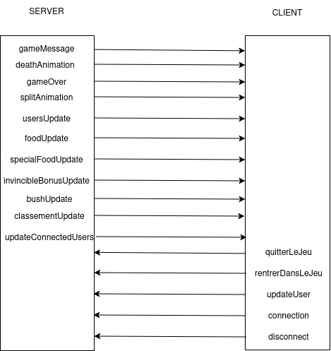

# HAGAR.IO - Agar.io Be Like réalisé en JS

## Informations
- **Nom** : Lucas DE JESUS TEIXEIRA, Louis Beck, Nils Vanderschooten-Akimoladum

## SOMMAIRE
1. [Description du projet](#description-du-projet)
2. [Fonctionnalités](#fonctionnalités)
3. [Technologies Utilisées](#technologies-utilisées)
4. [Installation, Configuration](#installation-configuration)
5. [Diagrammes de séquence](#diagrammes-de-séquence)
6. [Points Techniques Difficiles](#points-techniques-difficiles)
7. [Points d'Améliorations et Achèvements](#points-daméliorations-et-achèvements)
8. [Fiertés](#fiertés)
9. [Crédits](#crédits)

---

## Description du Projet

HAGAR.IO est un jeu inspiré d'Agar.io, permettant aux joueurs de vivre une expérience similaire. Développé en JavaScript, il utilise les technologies Canvas et Socket.IO pour offrir une expérience interactive et en temps réel.

---

## Fonctionnalités

- **Jeu** : Jouez au jeu et affrontez des bots ou de vrais joueurs en multijoueur.
- **Paramètres** : Choisissez entre le contrôle via clavier/souris ou gyroscope.
- **Règles du jeu** : Consultez les règles du jeu pour mieux comprendre les mécaniques.
- **Classement** : Visualisez le classement des joueurs pour voir qui est en tête.
- **Crédits** : Découvrez les contributeurs et les informations sur le projet.

---

## Technologies Utilisées

- **JavaScript** : Langage principal utilisé pour le développement du jeu.
- **Canvas API** : Pour le rendu graphique et les animations.
- **Socket.IO** : Pour la gestion de la communication en temps réel entre les joueurs.
- **Node.js** : Pour le backend et la gestion du serveur.
- **npm** : Pour la gestion des dépendances.
- **TDD (Test-Driven Development)** : Approche utilisée pour garantir la qualité du code et la fiabilité des fonctionnalités.

---

## Installation, Configuration

### Installation des dépendances
Avant de commencer, assurez-vous d'avoir Node.js et npm installés sur votre machine. Ensuite, installez les dépendances nécessaires en exécutant la commande suivante dans le répertoire du projet :
```bash
npm i
```

### Lancer le serveur
Pour démarrer le serveur en mode développement avec rechargement automatique, utilisez la commande suivante :
```bash
npm run server:watch
```

### Lancer le client
Pour démarrer le client et accéder au jeu, exécutez :
```bash
npm run client:start
```

### Notes supplémentaires
- Assurez-vous que le serveur est en cours d'exécution avant de lancer le client.

---

## Diagrammes de séquence



---

## Points Techniques Difficiles

- **Passage de toute la surface du jeu du client vers le serveur** : La synchronisation des données entre le client et le serveur a été un défi majeur, nécessitant une gestion précise des états pour garantir une expérience fluide.

- **Gestion du clavier après la séparation client/serveur** : Une fois le client et le serveur séparés, il a fallu repenser la gestion des événements clavier pour qu'ils soient correctement interprétés et transmis au serveur.

- **Gestion des images** : L'intégration et le rendu des images dans le jeu ont posé des problèmes, notamment en ce qui concerne leur chargement asynchrone et leur affichage fluide dans le canvas.


---

## Points d'Améliorations et Achèvements

### Achèvements
- Le jeu propose trois modes de déplacement : clavier, souris et gyroscope, offrant une grande flexibilité aux joueurs.
- Intégration d'un bonus d'invincibilité pour enrichir l'expérience de jeu.
- De nombreuses fonctionnalités implémentées, comme la séparation d'un personnage lors de la rencontre avec un buisson.

### Points d'Amélioration
- Ajouter des effets sonores et des musiques pour rendre le jeu plus immersif.
- Introduire des bonus supplémentaires pour diversifier les stratégies de jeu.
- Développer de nouveaux modes de jeu, comme un mode "Battle Royale", pour augmenter la rejouabilité.
- Optimiser les performances pour une meilleure fluidité, notamment sur les appareils mobiles.
- Améliorer l'interface utilisateur pour une navigation plus intuitive.
- Ajouter un tutoriel interactif pour aider les nouveaux joueurs à comprendre les mécaniques du jeu.
- Intégrer un système de personnalisation des avatars pour une expérience plus personnalisée.
- Étendre les fonctionnalités multijoueurs avec des salons privés et des options de matchmaking.
- Ajouter des statistiques détaillées pour permettre aux joueurs de suivre leurs performances.
- Explorer l'intégration de fonctionnalités sociales, comme un chat en jeu ou un système d'amis.

---

## Fiertés

Enfin, ce dont nous sommes le plus fiers, ce sont les images de professeurs et de personnes intégrées dans notre application, permettant de les faire combattre et d'ajouter une touche d'humour et de personnalisation au jeu.

---


## Crédits

Projet réalisé par **Lucas De Jesus Teixeira, Louis Beck et Nils Vanderschooten-Akimoladum** dans le cadre de la **SAE 4.A02.2 - Développement d'une application**.

---